## 📌 &nbsp; Pinned Projects

| Project | Description | Stack |
|---|---|---|
| [Hand Gesture Recognition](https://github.com/abhinav25232354/Hand-Gesture-Recognition---Major-Project-2026-BCA-) | Final-year BCA major project — real-time hand gesture control system | Python · MediaPipe · OpenCV · PyAutoGUI |
| [ThesisMate](https://github.com/abhinav25232354/ThesisMate) | AI-powered research assistant, Flask backend | Python · Flask · LLM |
| [J.A.R.V.I.S](https://github.com/abhinav25232354/J.A.R.V.I.S) | Personal virtual assistant — Iron Man approved | Python |
| [Steve Image Extractor](https://github.com/abhinav25232354/Steve-Image-Extractor-and-Comparer) | Batch OCR + diff tool for image-text comparison | Python |
| [Authorization CLI](https://github.com/abhinav25232354/Authorization-Application-CLI-with-Python) | Terminal-first auth management for people who live in the shell | Python |
| [100 Days of Python](https://github.com/abhinav25232354/100-Days-of-Python) | Full novice-to-expert Python challenge | Python |

 

## 📊 &nbsp; Live Stats

 

Built with intention. Animated with SVG. Shipped from a terminal.

